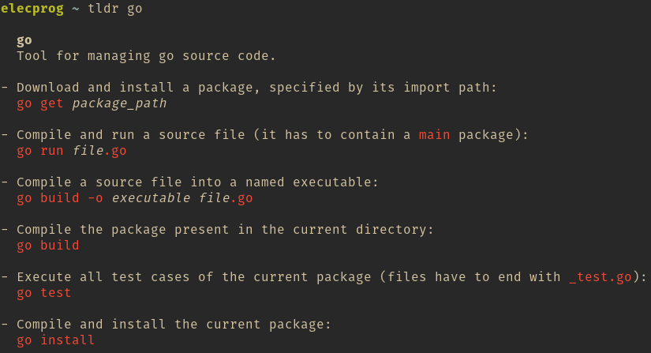

tldr
====

A [tldr](https://github.com/tldr-pages/tldr) client in Go, focusing on speed by storing pages in a database.

tldr is a collection of simplified, community-driven man pages. This application provides a fast and convenient access to these pages from the command line.

Here you see this client displaying the tldr page for Go:


As already mentioned is this client written in Go, we also uses etcd's [bbolt database](https://github.com/etcd-io/bbolt) which makes this client super fast.

Apart from being fast, the choice of Go also allows us to support all platforms which Go compiles to.

## Installation
You can use [Go](https://golang.org/)'s tooling

```
go get github.com/elecprog/tldr
go install github.com/elecprog/tldr
```

or download a binary for Linux or Windows from the [release page](https://github.com/elecprog/tldr/releases/latest/).

### Bash completion
On platforms that support it you can add bash completion by running:

```
sudo env "PATH=$PATH" sh -c "tldr --bash-completion > /etc/bash_completion.d/tldr"
sudo chmod 644 /etc/bash_completion.d/tldr
```

## Usage
- You can print information for one or more commands by using:
  ```
  tldr command1 [command2 ...]
  ```
- This client downloads all tldr pages on the first run (resulting in a database of about 500&nbsp;KB) which should only take a couple of seconds. To redownload the pages and rebuild the database you can use:
  ```
  tldr -u
  ```
  The database is then stored in the cache directory of your platform.
- If you want all the commands matching a grep style regex, let's say `g[ie]t$`, use:
  ```
  tldr -s 'g[ie]t$'
  ```
